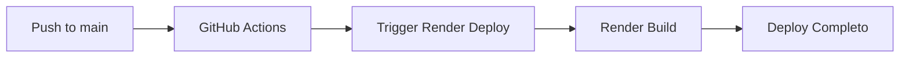

# 🚀 Guia de Deploy - ComplianceCore Mining

## 📋 Visão Geral

Este projeto utiliza **GitHub Actions** para CI/CD automático com deploy no **Render**.

## 🔄 Pipeline Automático

### Workflows Configurados

1. **`deploy.yaml`** - Deploy automático no Render
2. **`test.yml`** - Testes automatizados
3. **`python-ci.yml`** - CI para backend Python

### Fluxo de Deploy



## ⚙️ Configuração Inicial

### 1. Configurar Deploy Hook do Render

```bash
# Obter URL do Deploy Hook no Render Dashboard
# Settings → Deploy Hook

# Configurar como secret no GitHub
gh secret set RENDER_DEPLOY_HOOK --body "https://api.render.com/deploy/srv-XXXXX?key=YYYY"
```

### 2. Verificar Secrets Configurados

```bash
gh secret list
```

Secrets necessários:
- `RENDER_DEPLOY_HOOK` - URL do webhook do Render
- `DATABASE_URL` - URL do banco PostgreSQL
- `OPENAI_API_KEY` - API key da OpenAI

### 3. Testar Deploy Manual

```bash
# Testar webhook diretamente
curl -X POST "$RENDER_DEPLOY_HOOK"

# Deve retornar 200 OK
```

## 🐛 Troubleshooting

### Deploy falha com "HTTP 000"

**Causa**: URL do webhook incorreta ou malformada

**Solução**:
```bash
# Reconfigurar o secret
gh secret set RENDER_DEPLOY_HOOK --body "URL_CORRETA_AQUI"

# Trigger deploy manual
git commit --allow-empty -m "ci: trigger deploy"
git push origin main
```

### Build falha no Render

**Causa**: Dependências desatualizadas ou lockfile inconsistente

**Solução**:
```bash
# Recriar lockfile
rm pnpm-lock.yaml
pnpm install --no-frozen-lockfile
pnpm build

# Commit e push
git add pnpm-lock.yaml
git commit -m "ci: recria pnpm-lock.yaml"
git push origin main
```

### Erro "fetch first" no git push

**Solução**:
```bash
# Fazer rebase antes de push
git pull --rebase origin main
git push origin main
```

## �� Monitoramento

### Ver status dos workflows

```bash
# Listar últimas execuções
gh run list --limit 5

# Ver detalhes de uma execução
gh run view <RUN_ID>

# Ver logs de falha
gh run view <RUN_ID> --log-failed
```

### Verificar deploy no Render

1. Acesse: https://dashboard.render.com
2. Selecione o serviço "qivo-mining"
3. Veja logs em tempo real na aba **Logs**

## 🔄 Deploy Manual de Emergência

Se o pipeline automático falhar:

```bash
# 1. Fazer build local
pnpm install --no-frozen-lockfile
pnpm build

# 2. Trigger deploy via webhook
curl -X POST "https://api.render.com/deploy/srv-XXXXX?key=YYYY"

# 3. Ou fazer deploy manual pelo Dashboard do Render
# Dashboard → qivo-mining → Manual Deploy
```

## ✅ Checklist de Deploy

- [ ] Todos os testes passando localmente
- [ ] Build executado com sucesso
- [ ] Secrets configurados no GitHub
- [ ] Deploy Hook do Render válido
- [ ] Branch `main` atualizada
- [ ] Workflow executado sem erros
- [ ] Aplicação acessível em produção

## 📚 Referências

- [GitHub Actions Docs](https://docs.github.com/en/actions)
- [Render Deploy Hooks](https://render.com/docs/deploy-hooks)
- [pnpm Documentation](https://pnpm.io)

---

**Última atualização**: 01/11/2025
