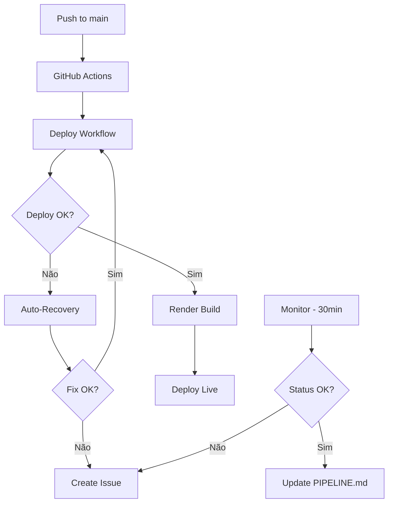

# 📚 Documentação DevOps - ComplianceCore Mining

## 🎯 Guias Disponíveis

### 🚀 Deploy & CI/CD
- **[DEPLOY.md](./DEPLOY.md)** - Guia completo de deploy e troubleshooting
- **[PIPELINE.md](./PIPELINE.md)** - Status do pipeline (atualizado automaticamente)
- **[RENDER_API_SETUP.md](./RENDER_API_SETUP.md)** - Como configurar monitoramento avançado

## 🏗️ Arquitetura do Pipeline



## ⚙️ Workflows Configurados

| Workflow | Trigger | Função | Documentação |
|----------|---------|--------|--------------|
| `deploy.yaml` | Push na `main` | Deploy automático no Render | [DEPLOY.md](./DEPLOY.md) |
| `monitor.yaml` | Cron 30min + Push | Monitora status e cria issues | [DEPLOY.md](./DEPLOY.md#-monitoramento--auto-recovery) |
| `auto-recovery.yaml` | Workflow failure | Corrige erros automaticamente | [DEPLOY.md](./DEPLOY.md#-auto-recovery-auto-recoveryyaml) |
| `test.yml` | Push + PR | Roda testes automatizados | - |
| `python-ci.yml` | Push + PR | CI do backend Python | - |

## 🔄 Fluxo de Trabalho Típico

### 1. Desenvolvimento Normal

```bash
# Fazer alterações
git add .
git commit -m "feat: nova funcionalidade"
git push origin main

# ✅ Deploy automático é acionado
# ✅ Em 2-3 minutos, está em produção
```

### 2. Monitoramento Contínuo

```bash
# Ver status atual
cat docs/PIPELINE.md

# Ver últimos deploys
gh run list --workflow="deploy.yaml" --limit 5

# Forçar verificação
gh workflow run monitor.yaml
```

### 3. Em Caso de Falha

```bash
# Sistema tenta auto-correção
# Se falhar, cria issue automaticamente
# Você recebe notificação

# Verificar issue criada
gh issue list --label="deploy-failure"

# Ver logs do auto-recovery
gh run list --workflow="auto-recovery.yaml" --limit 1
```

## 🚨 Cenários de Auto-Recovery

### Erro de Build (pnpm)

**Sintoma**: Build falha com erro `ENOMEM`, `254`, `137`

**Ação Automática**:
1. Detecta o erro
2. Remove `pnpm-lock.yaml`
3. Executa `pnpm install --no-frozen-lockfile`
4. Testa build
5. Commit e push automático

### Conflito de Git

**Sintoma**: `Updates were rejected because the remote contains work...`

**Ação Automática**:
1. Detecta rejeição
2. Executa `git pull --rebase origin main`
3. Retry do push (até 3 tentativas)
4. Sucesso ou criação de issue

### Webhook Inválido

**Sintoma**: HTTP 400, 401, 403, 404

**Ação Automática**:
1. Detecta erro HTTP 4xx
2. Testa webhook com curl
3. Log detalhado do erro
4. Issue criada com diagnóstico

## 📊 Métricas & Monitoramento

### Status em Tempo Real

- 🌐 **Produção**: https://qivo-mining.onrender.com
- 📊 **Dashboard**: https://dashboard.render.com/web/srv-d3sk5h1r0fns738ibdg0
- 🔧 **Actions**: https://github.com/theneilagencia/ComplianceCore-Mining/actions

### Comandos Úteis

```bash
# Status do serviço
gh run list --workflow="monitor.yaml" --limit 1

# Últimos deploys
gh run list --workflow="deploy.yaml" --limit 5

# Issues automáticas
gh issue list --label="automated"

# Logs do Render (requer login)
# Acessar: https://dashboard.render.com/web/srv-d3sk5h1r0fns738ibdg0/logs
```

## 🔑 Configuração Inicial

### Secrets Obrigatórios

```bash
gh secret set RENDER_DEPLOY_HOOK --body "https://api.render.com/deploy/..."
gh secret set DATABASE_URL --body "postgresql://..."
gh secret set OPENAI_API_KEY --body "sk-..."
```

### Secret Opcional (Monitoramento Avançado)

```bash
gh secret set RENDER_API_KEY --body "rnd_..."
```

📖 **Guia completo**: [RENDER_API_SETUP.md](./RENDER_API_SETUP.md)

## 🐛 Troubleshooting Rápido

| Problema | Solução |
|----------|---------|
| Deploy não inicia | Verificar se secret `RENDER_DEPLOY_HOOK` está configurado |
| Build falha no Render | Verificar logs em [Render Dashboard](https://dashboard.render.com/web/srv-d3sk5h1r0fns738ibdg0/logs) |
| Status "unknown" no PIPELINE.md | Configurar `RENDER_API_KEY` ([guia](./RENDER_API_SETUP.md)) |
| Issue não criada em falha | Verificar permissões do workflow (precisa de `issues: write`) |
| Push falha com conflito | Auto-recovery tentará resolver, se falhar verá issue |

## 📚 Documentação Adicional

- **[DEPLOY.md](./DEPLOY.md)** - Guia completo de deploy
- **[PIPELINE.md](./PIPELINE.md)** - Status atual (auto-atualizado)
- **[RENDER_API_SETUP.md](./RENDER_API_SETUP.md)** - Setup de monitoramento
- **[../README.md](../README.md)** - Documentação principal do projeto

## 🤖 Manutenção Zero

Este sistema foi projetado para funcionar autonomamente:

- ✅ Deploys automáticos
- ✅ Monitoramento contínuo (30min)
- ✅ Auto-correção de erros comuns
- ✅ Documentação auto-atualizada
- ✅ Issues criadas automaticamente
- ✅ Notificações em caso de falha

**Você só precisa agir quando receber uma issue de "manual-intervention"!**

---

**Mantido por**: GitHub Actions Workflows  
**Última atualização**: 01/11/2025  
**Responsável**: Engenheiro DevOps Autônomo 🤖
