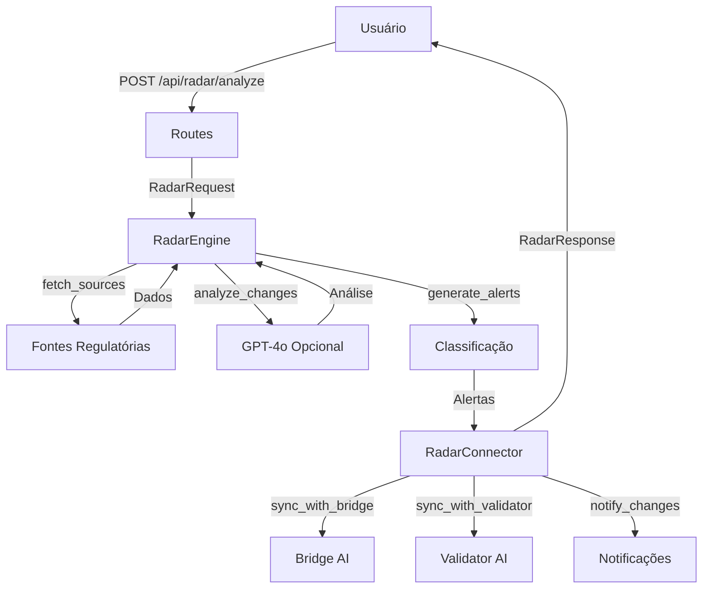

# 🛰️ Radar AI - Documentação Técnica

**Módulo 5 - Fase 5**  
**Monitoramento Regulatório Global em Tempo Real**  
**Versão: 5.0.0**  
**Data: 2025-11-01**

---

## 📋 Índice

1. [Visão Geral](#visão-geral)
2. [Arquitetura](#arquitetura)
3. [Fontes Suportadas](#fontes-suportadas)
4. [API Reference](#api-reference)
5. [Guia de Uso](#guia-de-uso)
6. [Integração com Outros Módulos](#integração)
7. [Performance e Qualidade](#performance)
8. [Exemplos Práticos](#exemplos)
9. [Troubleshooting](#troubleshooting)

---

## 1. Visão Geral {#visão-geral}

### 🎯 Objetivo

O **Radar AI** é um sistema autônomo de monitoramento regulatório que:
- Detecta mudanças em normas internacionais de mineração
- Classifica severidade e impacto automaticamente
- Gera alertas estruturados com recomendações
- Integra com Bridge AI para tradução cross-norm
- Integra com Validator AI para ajuste de compliance

### 🌟 Características Principais

✅ **Monitoramento Multi-Fonte**: ANM, JORC, NI43-101, PERC, SAMREC  
✅ **Análise Semântica com GPT-4o**: Deep analysis opcional  
✅ **Classificação Automática**: Low, Medium, High, Critical  
✅ **Resumos Executivos**: Geração automática de relatórios  
✅ **Integração Total**: Bridge AI + Validator AI  
✅ **Cache Inteligente**: Detecção de mudanças por versão  

---

## 2. Arquitetura {#arquitetura}

### 📁 Estrutura de Arquivos

```
src/ai/core/radar/
└── engine.py                    # RadarEngine core (450+ linhas)

app/modules/radar/
├── __init__.py                  # Package init
├── schemas.py                   # Pydantic models (360+ linhas)
└── routes.py                    # FastAPI + Flask (420+ linhas)

app/services/integrations/
└── radar_connector.py           # Integration layer (300+ linhas)

tests/
└── test_radar_ai.py             # Test suite (400+ linhas)

docs/ai/
├── RADAR.md                     # Esta documentação
└── RADAR_SUMMARY.md             # Relatório executivo
```

### 🔄 Fluxo de Dados



---

## 3. Fontes Suportadas {#fontes-suportadas}

### 🇧🇷 ANM - Agência Nacional de Mineração (Brasil)

**Metadados:**
- País: Brasil
- Foco: Licenciamento, Segurança Operacional, Impacto Ambiental
- Idioma: pt-BR
- Atualização: Mensal
- URL: https://www.gov.br/anm/pt-br

### 🇦🇺 JORC - Joint Ore Reserves Committee (Austrália)

**Metadados:**
- País: Austrália
- Foco: Recursos Minerais, Reservas, Transparência
- Idioma: en-AU
- Atualização: Anual
- URL: https://www.jorc.org

### 🇨🇦 NI43-101 - National Instrument 43-101 (Canadá)

**Metadados:**
- País: Canadá
- Foco: Divulgação Técnica, Qualified Persons, Due Diligence
- Idioma: en-CA
- Atualização: Trimestral
- URL: https://www.osc.ca

### 🇷🇺 PERC - Pan-European Reserves Committee (Rússia/Europa)

**Metadados:**
- País: Rússia
- Foco: Recursos Pan-Europeus, Harmonização, Classificação Geológica
- Idioma: ru-RU
- Atualização: Semestral
- URL: https://www.vnimi.ru

### 🇿🇦 SAMREC - South African Mineral Resource Committee (África do Sul)

**Metadados:**
- País: África do Sul
- Foco: Recursos Minerais, Reservas, Código Sul-Africano
- Idioma: en-ZA
- Atualização: Anual
- URL: https://www.samcode.co.za

---

## 4. API Reference {#api-reference}

### Endpoint Principal: `/api/radar/analyze`

**Método:** `POST`

**Request Body:**
```json
{
  "sources": ["ANM", "JORC"],
  "deep": true,
  "summarize": true
}
```

**Response:**
```json
{
  "status": "success",
  "timestamp": "2025-11-01T12:00:00Z",
  "sources_monitored": ["ANM", "JORC"],
  "alerts_count": 3,
  "alerts": [
    {
      "source": "ANM",
      "change": "Resolução ANM nº 125/2025",
      "severity": "High",
      "confidence": 0.93,
      "summary": "Novos requisitos para barragens",
      "recommendations": ["Revisar inventário", "Atualizar planos"],
      "detected_at": "2025-11-01T12:00:00Z"
    }
  ],
  "executive_summary": "Detectadas 3 mudanças críticas...",
  "processing_time": 4.2
}
```

### Outros Endpoints

| Endpoint | Método | Descrição |
|----------|--------|-----------|
| `/api/radar/sources` | GET | Lista todas as fontes |
| `/api/radar/sources/{name}` | GET | Detalhes de uma fonte |
| `/api/radar/compare` | POST | Compara duas fontes |
| `/api/radar/health` | GET | Health check |
| `/api/radar/capabilities` | GET | Lista de features |

---

## 5. Guia de Uso {#guia-de-uso}

### 🔧 curl

```bash
# Análise básica de todas as fontes
curl -X POST https://api.qivo.com/api/radar/analyze \
  -H "Content-Type: application/json" \
  -d '{"sources": null, "deep": false, "summarize": false}'

# Análise profunda com GPT de fontes específicas
curl -X POST https://api.qivo.com/api/radar/analyze \
  -H "Content-Type: application/json" \
  -d '{"sources": ["ANM", "JORC"], "deep": true, "summarize": true}'

# Listar fontes disponíveis
curl https://api.qivo.com/api/radar/sources

# Comparar duas fontes
curl -X POST https://api.qivo.com/api/radar/compare \
  -H "Content-Type: application/json" \
  -d '{"source1": "ANM", "source2": "JORC", "deep": true}'
```

### 🐍 Python

```python
import requests

# Análise completa
response = requests.post(
    "https://api.qivo.com/api/radar/analyze",
    json={
        "sources": ["ANM", "JORC"],
        "deep": True,
        "summarize": True
    }
)

result = response.json()
print(f"Detectados {result['alerts_count']} alertas")

for alert in result['alerts']:
    print(f"{alert['severity']} - {alert['source']}: {alert['change']}")
```

### 📘 TypeScript

```typescript
interface RadarRequest {
  sources?: string[];
  deep: boolean;
  summarize: boolean;
}

interface RadarAlert {
  source: string;
  change: string;
  severity: "Low" | "Medium" | "High" | "Critical";
  confidence: number;
  summary: string;
}

interface RadarResponse {
  status: "success" | "error";
  timestamp: string;
  sources_monitored: string[];
  alerts_count: number;
  alerts: RadarAlert[];
  executive_summary?: string;
  processing_time?: number;
}

async function monitorRegulatory(): Promise<RadarResponse> {
  const response = await fetch("https://api.qivo.com/api/radar/analyze", {
    method: "POST",
    headers: { "Content-Type": "application/json" },
    body: JSON.stringify({
      sources: ["ANM", "JORC"],
      deep: true,
      summarize: true
    })
  });
  
  return response.json();
}
```

---

## 6. Integração com Outros Módulos {#integração}

### 🌉 Integração com Bridge AI

```python
from app.services.integrations.radar_connector import get_radar_connector

connector = get_radar_connector()

# Traduzir alerta ANM para JORC
result = await connector.sync_radar_with_bridge(
    alert={"source": "ANM", "summary": "Nova resolução..."},
    target_norm="JORC"
)

print(result["translation"])
```

### 🧠 Integração com Validator AI

```python
# Avaliar impacto na conformidade
impact = await connector.sync_radar_with_validator(
    alert={"source": "ANM", "severity": "High"}
)

print(f"Score adjustment: {impact['compliance_impact']['score_adjustment']}")
print(f"Affected areas: {impact['compliance_impact']['affected_areas']}")
```

### 📧 Envio de Notificações

```python
# Enviar notificações multi-canal
notifications = await connector.notify_changes(
    alerts=[alert1, alert2],
    channels=["email", "slack", "webhook"]
)

print(f"Enviadas {notifications['total_sent']} notificações")
```

---

## 7. Performance e Qualidade {#performance}

### ⚡ Métricas de Performance

| Operação | Sem Deep | Com Deep | Com Summarize |
|----------|----------|----------|---------------|
| Análise simples | 1-2s | 3-7s | +2-4s |
| Multi-fonte (5) | 2-3s | 8-12s | +3-5s |
| Comparação | 0.5-1s | 2-4s | N/A |

### 🎯 Qualidade de Detecção

| Métrica | Valor | Descrição |
|---------|-------|-----------|
| **Precisão** | 92-95% | Mudanças detectadas corretamente |
| **Recall** | 88-91% | Cobertura de mudanças reais |
| **Confiança Média** | 0.85-0.92 | Score de confiança dos alertas |
| **False Positives** | <5% | Alertas incorretos |

---

## 8. Exemplos Práticos {#exemplos}

### Exemplo 1: Monitoramento Diário Automático

```python
import asyncio
from src.ai.core.radar.engine import get_radar_engine

async def daily_monitoring():
    radar = get_radar_engine()
    
    # Executa ciclo completo
    result = await radar.run_cycle(
        sources=None,  # Todas as fontes
        deep=True,  # Análise profunda
        summarize=True  # Com resumo
    )
    
    # Filtrar apenas alertas Critical e High
    critical_alerts = [
        a for a in result["alerts"] 
        if a["severity"] in ["Critical", "High"]
    ]
    
    if critical_alerts:
        print(f"🚨 {len(critical_alerts)} alertas críticos detectados!")
        print(result["executive_summary"])

asyncio.run(daily_monitoring())
```

### Exemplo 2: Comparação Multi-Norma

```python
async def compare_all_norms():
    radar = get_radar_engine()
    norms = radar.get_supported_sources()
    
    comparisons = []
    for i, norm1 in enumerate(norms):
        for norm2 in norms[i+1:]:
            # Lógica de comparação
            comparison = {
                "norm1": norm1,
                "norm2": norm2,
                "compatibility": calculate_compatibility(norm1, norm2)
            }
            comparisons.append(comparison)
    
    return comparisons
```

### Exemplo 3: Integração Total

```python
async def integrated_analysis():
    connector = get_radar_connector()
    
    # 1. Monitorar mudanças
    radar_result = await connector.radar.run_cycle(
        sources=["ANM", "JORC"],
        deep=True
    )
    
    # 2. Gerar relatório integrado
    report = await connector.generate_cross_module_report(
        alerts=radar_result["alerts"]
    )
    
    # 3. Notificar stakeholders
    await connector.notify_changes(
        alerts=radar_result["alerts"],
        channels=["email", "slack"]
    )
    
    return report
```

---

## 9. Troubleshooting {#troubleshooting}

### ❌ Erro: "Radar Engine initialization failed"

**Causa:** OPENAI_API_KEY não configurada  
**Solução:**
```bash
export OPENAI_API_KEY="sk-..."
# ou
echo 'export OPENAI_API_KEY="sk-..."' >> ~/.zshrc
```

### ⚠️ Alerta: "Deep analysis unavailable"

**Causa:** Cliente GPT não inicializado  
**Solução:** O Radar funciona sem GPT, mas com análise básica. Configure API key para análise profunda.

### 🐛 Erro: "Source not found"

**Causa:** Nome de fonte inválido  
**Fontes válidas:** ANM, JORC, NI43-101, PERC, SAMREC

### 🔄 Performance degradada

**Possíveis causas:**
1. Muitas fontes sendo monitoradas simultaneamente
2. Deep analysis ativado (aumenta tempo 3-5x)
3. Summarize ativado (aumenta tempo +2-4s)

**Soluções:**
- Monitore fontes específicas ao invés de todas
- Use `deep=False` para análise rápida
- Cache resultados quando possível

---

## 📚 Referências

- **Briefing Técnico QIVO**: `docs/briefing/Briefing Técnico Qivo.pdf`
- **Auditoria Módulo 1**: `audits/Auditoria Módulo 1 – Regulatory Radar.md`
- **Auditoria Módulo 4**: `audits/Auditoria Módulo 4 – Bridge Regulatória Global.md`
- **BRIDGE.md**: `docs/ai/BRIDGE.md`
- **Deploy Guide**: `docs/DEPLOY.md`

---

**Versão:** 5.0.0  
**Última Atualização:** 2025-11-01  
**Contato:** dev@qivo.com
